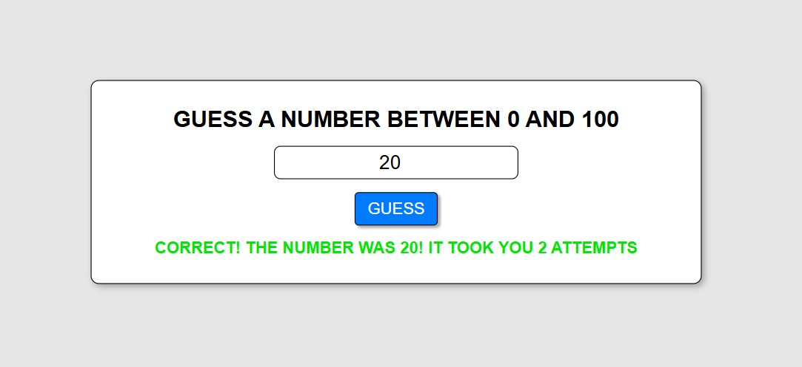

# Number Guesser

## Project Summary

Number Guesser is a simple, interactive web app where users try to guess a randomly generated number within a set range. It provides instant feedback, tracks attempts, and displays a congratulatory message when the correct number is guessed.

Built with vanilla HTML, CSS, and JavaScript, the app demonstrates the power of core web technologies without external frameworks. Its clean, responsive design ensures a smooth experience across all device sizes.

## Table of Contents

- [Mock-Up](#mock-up)
- [Instructions](#instructions)
- [Key Features](#key-features)
- [Deployed Application](#deployed-application)

## Mock-Up

The following image demonstrates the application's user interface:

## Instructions

To run and use the application:

1. Clone this repository or download the project files.

2. Open `index.html` in any modern web browser.

3. Enter a number within the displayed range.

4. Press the **"GUESS"** button or hit **Enter**.

5. Receive real-time feedback until you guess the correct number.

## Key Features

- **Attempt Counter:** Tracks how many tries the user has made.

- **Instant Feedback:** Displays whether the guess is too high, too low, or correct.

- **Input Validation:** Ensures user input is a valid number within the defined range.

- **Keyboard Accessibility:** Supports "Enter" key for submissions in addition to clicking the button.

- **Responsive Design:** Optimized for all screen sizes — from mobile phones to ultra-wide monitors.

- **Polished UI:** Clean layout with smooth button transitions, hover effects, and styled feedback text.

- **Random Number Generation:** Generates a new number between the set minimum and maximum at each page load.

## Deployed Application

[Number Guesser](https://gilmerperez.github.io/number-guesser/)